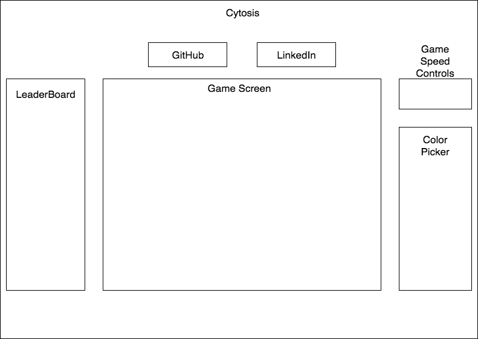

# JS Project: Cytosis

### Background

Cytosis is javascript recreation of the classic Agar.io game. The player
controls a small circle and can move around the view plane with
the arrow keys.  The player must consume smaller circles to
grow in size while avoiding being eaten by larger ones.  

### Functionality and MVP

In Cytosis users will be able to:

- [ ] Start and pause the game
- [ ] Choose a color for their circle
- [ ] Move their circle around the game board with WASD or Arrow keys
- [ ] See their score
- [ ] Change game speed

This project will also include:
- [ ] A production README

### Wireframes

Cytosis will have a single game screen, that is centered upon the users
circle.  Above the game will be the game name as well as links to my
GitHub and LinkedIn.  Below the game will be a section for game controls
and directions.  To the right of the game window will be buttons to allow
the user to change the game speed as well as the color of their circle.
To the left of the game screen will be the scoreboard

### Technologies

* JavaScript
* Canvas

The game logic will be handled with vanilla javascript while the rendering
will be controlled by Canvas.

The game will consist of 3 main scripts:

`window.js` will be the main viewport for the game, responsible for rendering the user controlled circle as well as the consumable circles

`cytosis.js` will handle the logic for generating the consumable circles. It will also handle user input and circle collision handlers.

`circle.js` will include the constructor for each Circle object.  Circles will have a size, a direction, and velocity

### Implementation Timeline

#### Day 1
Setup necessary files and learn how to use Canvas in conjunction with javascript.

Goals:
* Have viewport finished
* User controlled circle

#### Day 2
Create generation logic for consumable circles as well as collision logic

Goals:
* Consumable circles appear on viewport
* Consumable circles are either consumed or consume the player upon collision

#### Day 3

Render user scoring as well as selectable color and game speed

Goals:
* Users can see their score, based on their current size
* Users can change the speed of the game
* Users can change their circles color

### Bonus Features
- [ ] Add leaderboard for player scores 
